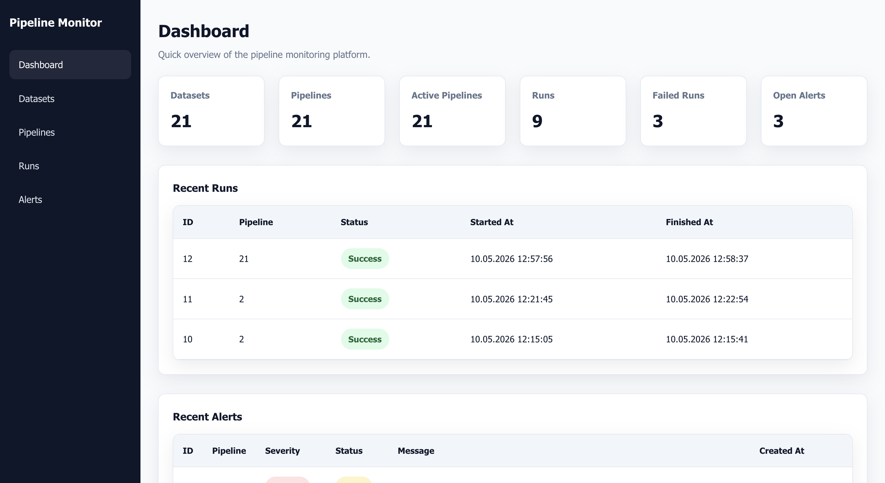

# Big Data Pipeline Monitor

Big Data Pipeline Monitor is a full-stack web application for managing and monitoring data pipelines.  
The project provides a FastAPI backend and a React frontend for working with datasets, pipelines, runs, run steps, alerts, and related entities.

## Application Preview



## Overview

The goal of this project is to simulate and monitor the lifecycle of data pipelines in one place.  
Users can manage datasets and pipelines, trigger pipeline runs, track execution progress, inspect run details and steps, and monitor operational alerts such as long-running or failed runs.

This project is structured as a classic full-stack application:

- **Backend:** FastAPI + SQLAlchemy
- **Frontend:** React + Vite
- **Database:** SQLite
- **API style:** REST API

## Features

- Dataset management
- Pipeline management
- Run execution and monitoring
- Run step tracking
- Alert and alert rule management
- Pipeline version support
- User entity support
- Frontend dashboard for operational monitoring

## Tech Stack

### Backend
- Python 3.14
- FastAPI
- SQLAlchemy
- Uvicorn
- SQLite
- python-dotenv

### Frontend
- React
- Vite
- React Router
- Axios
- ESLint

## Project Structure

```text
big-data-pipeline/
├── backend/
│   ├── core/
│   ├── db/
│   ├── models/
│   ├── routers/
│   ├── schemas/
│   ├── services/
│   ├── main.py
│   ├── pyproject.toml
│   └── database.db
├── frontend/
│   ├── public/
│   ├── src/
│   ├── package.json
│   └── vite.config.js
└── README.md
```

### Backend structure
- `main.py` — FastAPI application entry point
- `core/` — configuration and shared setup
- `db/` — database connection and table creation
- `models/` — SQLAlchemy models
- `schemas/` — Pydantic schemas for request and response validation
- `routers/` — API endpoints
- `services/` — business logic and pipeline simulation

### Frontend structure
- `src/` — application source code
- `public/` — static assets
- `package.json` — frontend dependencies and scripts

## Main Entities

The backend is built around these core entities:

- **Dataset** — registered source dataset
- **Pipeline** — configurable data pipeline
- **PipelineVersion** — versioned definition of a pipeline
- **Run** — single pipeline execution instance
- **RunStep** — individual execution step inside a run
- **Alert** — monitoring or failure notification
- **AlertRule** — rule for generating alerts
- **User** — user entity

## How It Works

1. A dataset is registered in the system.
2. A pipeline is created and linked to a dataset.
3. A pipeline can be started manually.
4. The backend creates a new run and simulates its execution.
5. Each run contains multiple run steps such as extract, validate, transform, and load.
6. The monitoring loop checks long-running runs and creates alerts if needed.
7. The frontend displays current system data and execution history.

## Backend Setup

### Requirements
- Python 3.14+
- `uv` or `pip`
- virtual environment recommended

### Install dependencies

From the `backend` folder:

```bash
cd backend
uv sync
```

If you are using an existing virtual environment:

```bash
source .venv/bin/activate
uv sync
```

### Run backend

```bash
cd backend
source .venv/bin/activate
uv run uvicorn main:app --reload
```

Backend will be available at:

- API root: [http://127.0.0.1:8000/](http://127.0.0.1:8000/)
- Swagger UI: [http://127.0.0.1:8000/docs](http://127.0.0.1:8000/docs)

## Frontend Setup

### Requirements
- Node.js
- npm

### Install dependencies

From the `frontend` folder:

```bash
cd frontend
npm install
```

### Run frontend

```bash
cd frontend
npm run dev
```

The frontend will usually be available at:

- [http://localhost:5173](http://localhost:5173)

## API Overview

The backend exposes REST endpoints for working with the main resources:

- `/api/datasets`
- `/api/pipelines`
- `/api/runs`
- `/api/run-steps`
- `/api/alerts`
- `/api/alert-rules`
- `/api/pipeline-versions`
- `/api/users`

Detailed API documentation is available in Swagger UI after starting the backend:  
[http://127.0.0.1:8000/docs](http://127.0.0.1:8000/docs)

## Running the Project Locally

### 1. Start backend
```bash
cd backend
source .venv/bin/activate
uv run uvicorn main:app --reload
```

### 2. Start frontend in a second terminal
```bash
cd frontend
npm install
npm run dev
```

### 3. Open the app
- Frontend: [http://localhost:5173](http://localhost:5173)
- Backend docs: [http://127.0.0.1:8000/docs](http://127.0.0.1:8000/docs)

## Author

Project created as a school and learning project focused on data pipeline monitoring, backend API development, and frontend dashboard development.
